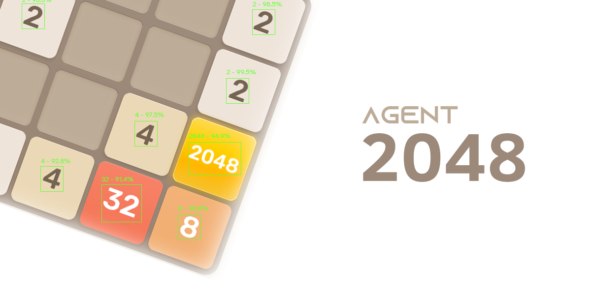
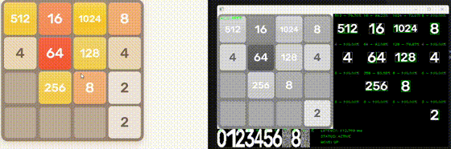

# Agent 2048




A software agent that's able to play most instances of 2048 live on your computer.



## Installation

Clone this repository using:
```
git clone https://github.com/a22Dv/agent-2048.git
```
Create a virtual environment using:
```
python -m venv venv
```
Then run:
```
pip install -e .
pip install -r requirements.txt
```
Finally, to use the program, run it directly as a module yourself.

```
python -m agent_2048
```
>[!NOTE]
>This program has only been tested on a Windows 11 system. The bundled
>.pyd file was also built with Windows in mind. Should you encounter
>issues regarding this, you'll need to build using ./build if you're on
>Windows, or edit the CMakeLists.txt yourself according to your system
>specifications.

## Features

- **Broad Compatibility**
    - Can work with most 2048 boards regardless
    of website and adapts on the fly.
- **Real-Time Visualization**
    - Shows what the agent sees and its current state.
- **On-the-fly board detection**
    - Detects the game board wherever it might be on
    your screen.
    - Automatically learns the first digits of your specific
    board regardless of font, so long as it is provided an initial board state.
- **Live Gameplay**
    - Controls your keyboard and mouse to act on its
    decisions based on the board state.

## License

This project is licensed under the MIT License - see LICENSE for more details.

## Author

a22Dv - a22dev.gl@gmail.com


